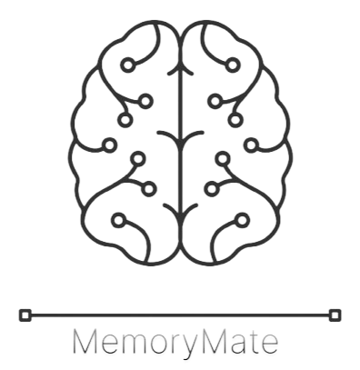
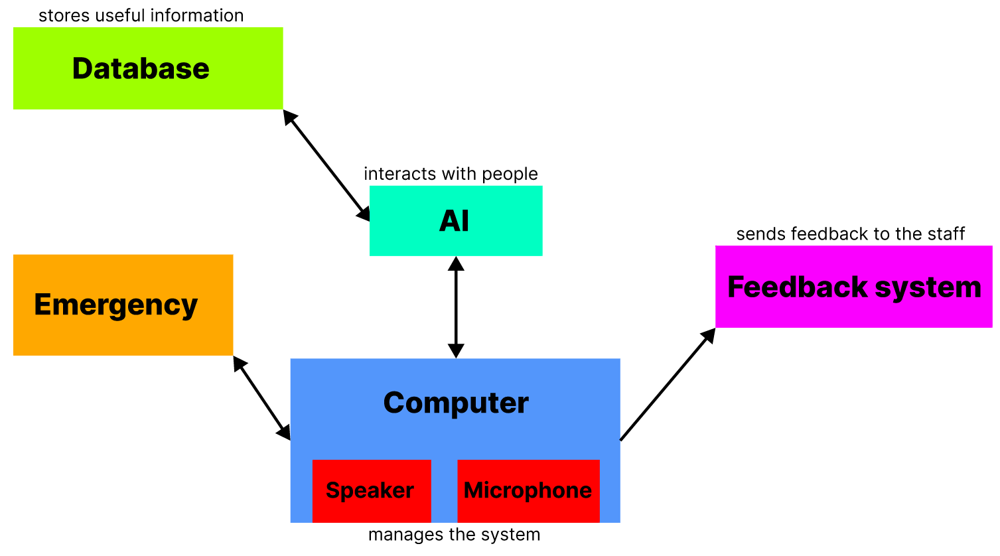

# MemoryMate

# Functional Specifications

This project has been started as my moonshot project for ALGOSUP.

The goal of the project is to create an Artificial Intelligence linked with a database that supports individuals with Alzheimer's in their daily lives. The AI could understand voice orders.

Table of Contents

- [MemoryMate](#memorymate)
- [Functional Specifications](#functional-specifications)
  - [Stakeholders](#stakeholders)
    - [Project Member](#project-member)
    - [Other Stakeholders](#other-stakeholders)
  - [Project Scope](#project-scope)
  - [Deliverables and Milestones](#deliverables-and-milestones)
  - [Functional Requirements](#functional-requirements)
    - [Product](#product)
    - [Voice Recognition](#voice-recognition)
    - [Personal Information Database](#personal-information-database)
    - [Memory Aid Functionality](#memory-aid-functionality)
    - [Voice Response](#voice-response)
    - [Learning and Adaptation](#learning-and-adaptation)
    - [Emergency Assistance](#emergency-assistance)
    - [Accessibility Features](#accessibility-features)
    - [Multi-language Support](#multi-language-support)
    - [Security and Authentication](#security-and-authentication)
    - [Scalability and Performance](#scalability-and-performance)
    - [User Feedback and Reporting](#user-feedback-and-reporting)
  - [Personas and Use Cases](#personas-and-use-cases)
    - [Persona 1 - Daniella Brabushka](#persona-1---daniella-brabushka)
      - [Goals](#goals)
      - [Challenges](#challenges)
    - [Persona 2 - Josh Kepper](#persona-2---josh-kepper)
        - [Goals](#goals-1)
        - [Challenges](#challenges-1)
    - [Persona 3 - Jessica Yota](#persona-3---jessica-yota)
      - [Goals](#goals-2)
      - [Challenges](#challenges-2)
    - [Use Cases](#use-cases)
  - [Acceptance Criteria](#acceptance-criteria)
    - [Voice Recognition](#voice-recognition-1)
    - [Personal Information Database](#personal-information-database-1)
    - [Memory Aid Functionality](#memory-aid-functionality-1)
    - [Voice Response](#voice-response-1)
    - [Learning and Adaptation](#learning-and-adaptation-1)
    - [Emergency Assistance](#emergency-assistance-1)
    - [Accessibility Features](#accessibility-features-1)
    - [Multi-language Support](#multi-language-support-1)
    - [Security and Authentication](#security-and-authentication-1)
    - [Scalability and Performance](#scalability-and-performance-1)
    - [User Feedback and Reporting](#user-feedback-and-reporting-1)
  - [Solution Overview](#solution-overview)
  - [Non-functional Requirements](#non-functional-requirements)
    - [Product](#product-1)
    - [Voice Recognition](#voice-recognition-2)
    - [Personal Information Database](#personal-information-database-2)
    - [Memory Aid Functionality](#memory-aid-functionality-2)
    - [Voice Response](#voice-response-2)
    - [Learning and Adaptation](#learning-and-adaptation-2)
    - [Emergency Assistance](#emergency-assistance-2)
    - [Accessibility Features](#accessibility-features-2)
    - [Multi-language Support](#multi-language-support-2)
    - [Security and Authentication](#security-and-authentication-2)
    - [Scalability and Performance](#scalability-and-performance-2)
    - [User Feedback and Reporting](#user-feedback-and-reporting-2)
  - [Risks and Assumptions](#risks-and-assumptions)
  - [Future Improvements](#future-improvements)
  - [Glossary](#glossary)

## Stakeholders

### Project Member

| Name        | Occupation               | Links                                                             |
| --------------- | ------------------------ | ----------------------------------------------------------------- |
| Enzo GUILLOUCHE | Project Multitasker     | [LinkedIn](https://www.linkedin.com/in/enzoguillouche/) |

### Other Stakeholders

| Name           | Occupation                  | Links                          |
| -------------- | --------------------------- | ------------------------------ |
| Franck JEANNIN | ALGOSUP's director | [Website](https://algosup.com/en.html) |

## Project Scope

We have multiple objectives for this project:

- Creation of an AI system and a [database](#glossary).
- Link between both the AI and the database.
- Implementation of a [NLP](#glossary) to process voices.
- Security of the database and personal information.

## Deliverables and Milestones

- [Functional Specifications](../Functional/functionalSpecifications.md)
- [Technical Specifications](../Technical/technicalSpecifications.md)
- [The Architecture Diagram](../Technical/Img/architectureDiagram.png)
- [The Test Plan](../Test/testPlan.md)
- The Product
- Unit Tests
- [All the Monthly Reports](../Management/MonthlyReports/monthlyReportCumulative.md)

## Functional Requirements

### Product

The product deals with:

- A personal AI that processes voice orders and answers them as voice.
- A database linked with the AI, containing and supplying personal information.

It has to contain all the requirements below:

### Voice Recognition

- The system should accurately recognize the voices of registered users.
- It should be able to distinguish between different users' voices.
- The recognition should work even in noisy environments.

### Personal Information Database

- The system should have a secure database to store personal information of users.
- It should allow authorized personnel to update and manage the database.
- Compliance with data privacy regulations such as [GDPR or HIPAA](#glossary) should be ensured.

### Memory Aid Functionality

- MemoryMate prompts should be tailored to individual users based on their personal information.
- The system should remind users of important events, appointments, and tasks.
- It should assist users in recalling names, faces, and other relevant information.

### Voice Response

- The system should respond to user queries and prompts using natural language processing.
- Responses should be clear, concise, and personalized based on the user's profile.

### Learning and Adaptation

- MemoryMate should continuously learn from user interactions and adapt its responses accordingly.
- It should improve its accuracy in voice recognition and personalization over time.

### Emergency Assistance

- The system should have a feature to alert caregivers or emergency contacts in case of emergencies or when the user requires immediate assistance.

### Accessibility Features

- MemoryMate should have accessibility features such as adjustable font sizes, voice commands, and compatibility with screen readers for visually impaired users.

### Multi-language Support

- The system should support multiple languages to supply understandable information to users from diverse linguistic backgrounds.

### Security and Authentication

- Robust authentication mechanisms should be in place to ensure that only authorized users can access personal information stored in the database.
- Measures like encryption should be implemented to protect sensitive data.

### Scalability and Performance

- Response times for voice recognition and query processing should be kept within acceptable limits.

### User Feedback and Reporting

- MemoryMate should allow users to provide feedback on the system's performance and suggest improvements.
- It should generate reports for caregivers or healthcare professionals to track the user's interactions and usage patterns.

## Personas and Use Cases

### Persona 1 - Daniella Brabushka

| Daniella Brabushka                                                                      | 69 years old                                                                                                                                                                                                                                                                                     |
| --------------------------------------------------------------------------------- | ------------------------------------------------------------------------------------------------------------------------------------------------------------------------------------------------------------------------------------------------------------------------------------------------ |
|  | **Description:** Daniella is a woman suffering from Alzheimer's and diabetes. She's quite autonomous though she's having a hard time remembering important things such as appointments and insuline injections.  **Frequence of use:**  - Often |

#### Goals

- Daniella wants an AI that can remind her of important appointments, tasks, and events throughout the day.
- She wants to remember to take her medication on time and in the correct doses.
- She wants something offering companionship and reassurance during moments of confusion or distress.
- She wants a tool being able to call for help in case of emergencies, such as falls or medical issues.

#### Challenges

- Daniella could have a hard time dealing with the fact that she may forget how to interact with the AI or forget the purpose of certain features over time.
- The AI needs to adapt to Daniella's changing needs and abilities as her condition progresses.
- Communication and coordination between the AI and Daniella's caregivers should be regulated and calibrated, to ensure consistent support.
- She will have to create a sense of trust and familiarity between her and the AI to encourage her to rely on it for assistance.

### Persona 2 - Josh Kepper

| Josh Kepper                                                                      | 32 years old                                                                                                                                                                                                                                                                                     |
| --------------------------------------------------------------------------------- | ------------------------------------------------------------------------------------------------------------------------------------------------------------------------------------------------------------------------------------------------------------------------------------------------ |
|  | **Description:** Josh is a caring son facing the challenges of caring for his father, who is suffering from Alzheimer's disease. Despite his demanding job, Josh prioritizes his family above all else.  **Frequence of use:**  - Often |

##### Goals

- Josh aims to provide the best possible care for his father while allowing him to maintain a sense of independence and dignity at home.
- He wants a tool that can assist in monitoring his father's well-being and ensuring his safety, even if he's not physically present.
- He desires a solution that can adapt to his father's preferences, habits, and changing needs over time.

##### Challenges

- Josh may face a learning curve in setting up and utilizing the AI system, especially if it involves complex configurations or interfaces.
- He will need to trust that the AI can provide the right support at the right time.
- He will need a solution that seamlessly fits into his father's daily life without causing disruption.

### Persona 3 - Jessica Yota

| Jessica Yota                                                                      | 27 years old                                                                                                                                                                                                                                                                                     |
| --------------------------------------------------------------------------------- | ------------------------------------------------------------------------------------------------------------------------------------------------------------------------------------------------------------------------------------------------------------------------------------------------ |
|  | **Description:** Jessica is a care assistant helping her patients at home, who is suffering from Alzheimer's disease. She's dedicated to her job, regardless how many patients she has.  **Frequence of use:**  - Sometimes |

#### Goals

- Jessica wants the best for her patients. She will need a tool that would help her look after many patients.
- She would want to monitor and help specific patients 24/7, due to their specificities.

#### Challenges

- Jessica wonders if she needs to be available at any time if something goes wrong.
- She's nervous not knowing whether the AI will be the same for her and her patients or not, in terms of functionalities and accessibility.

### Use Cases

**Actor: Alzheimer's patient**
The user relies on MemoryMate to remind them of daily tasks, events and medication. They use voice commands to ask MemoryMate about upcoming appointments, medication schedules, or important dates. MemoryMate provides personalized reminders based on the user's profile and preferences, helping the user stay organized and independent.

**Actor: Alzheimer's patient**
The user engages in conversations with MemoryMate to remember about past experiences, family members, or hobbies. MemoryMate utilizes its database of personal information to tailor the conversation to the user's interests and memories. It prompts the user with relevant questions and anecdotes, providing companionship and cognitive stimulation.

**Actor: Alzheimer's patient, caregiver**
MemoryMate's emergency assistance feature detects an unexpected sound, and asks the patient if he's whether safe or not. If there's no answer, MemoryMate alerts designated caregivers or emergency contacts, providing them with the user's location and relevant medical information from the database. Caregivers can then take appropriate action to ensure the user's safety and well-being.

**Actor: Multilingual Alzheimer's patient**
The user communicates with MemoryMate in their preferred language, which may differ from the default language of the system. MemoryMate recognizes the user's language preference and responds accordingly, providing assistance and information in the desired language. This feature enhances accessibility for users from diverse linguistic backgrounds, ensuring effective communication and understanding.

**Actor: Alzheimer's patient, caregiver**
As the user and their caregivers use MemoryMate, it  triggers a feedback mechanism integrated into its system to report any issues encountered or suggest improvements. MemoryMate collects and analyzes this feedback to identify areas for enhancement and refinement. Based on user input, MemoryMate iteratively improves its functionalities and user experience at any time, ultimately better serving the needs of individuals with Alzheimer's and their caregivers.

## Acceptance Criteria

### Voice Recognition

- The system should accurately recognize the voices of at least 90% of registered users in a quiet environment.
- In noisy environments, voice recognition should maintain an accuracy rate of at least 75%.

### Personal Information Database

- The database should securely store personal information, accessible only to authorized personnel.
- Users should be able to update their personal information without encountering errors or data loss.

### Memory Aid Functionality

- MemoryMate prompts should be customized based on user profiles and preferences.
- Reminders should be timely and relevant, with an option for users to confirm or dismiss them.

### Voice Response

- Responses to user queries should be coherent and relevant to the context.
- The system should demonstrate an understanding of natural language queries and provide appropriate responses.

### Learning and Adaptation

- MemoryMate should demonstrate improvement in accuracy and personalization over time, as evidenced by user feedback and performance metrics.
- Adaptations to user preferences and habits should be noticeable within a reasonable timeframe of system usage.

### Emergency Assistance

- The emergency alert feature should reliably notify designated caregivers or emergency contacts in case of emergencies.
- Emergency alerts should be triggered promptly and accurately based on predefined criteria.

### Accessibility Features

- Accessibility features such as adjustable font sizes and screen reader compatibility should be tested with users with varying degrees of visual impairment for usability and effectiveness.

### Multi-language Support

- The system should accurately recognize and respond to queries in multiple languages, including but not limited to English, and French.
- Language support should extend to both voice recognition and response functionalities.

### Security and Authentication

- User authentication mechanisms should be tested for robustness against unauthorized access attempts.
- Sensitive data stored in the database should be encrypted and inaccessible to unauthorized users.

### Scalability and Performance

- The system should demonstrate consistent performance under varying loads, with response times remaining within acceptable limits even during peak usage.
- Scalability tests should confirm the system's ability to handle an increasing number of users and data without degradation in performance.

### User Feedback and Reporting

- Users should be able to provide feedback on the system's performance and suggest improvements through an intuitive feedback mechanism.
- Reports generated by MemoryMate for caregivers and healthcare professionals should be comprehensive and actionable, providing insights into user interactions and usage patterns.

## Solution Overview

**MemoryMate would be an AI system.**
- It would therefore contain an AI, helping people in their everyday lives. The AI would communicate with the patients by voice, it means that either the patients and the AI would talk.
- A secured database would be linked to the AI, it's where the system can find any specific or personal information about the patient. The information can be supplied whether by the patient himself or by caregivers.
- A computer would be the centralized device that manages all the system. We would be able to interact with the AI with it, manage the database, send feedbacks, change settings, etc.
- The system would need a powerful microphone to understand clearly voices, and powerful speakers to be clearly understandable.

## Non-functional Requirements

### Product

<!-- TO-DO -->

### Voice Recognition

<!-- TO-DO -->

### Personal Information Database

<!-- TO-DO -->

### Memory Aid Functionality

<!-- TO-DO -->

### Voice Response

<!-- TO-DO -->

### Learning and Adaptation

<!-- TO-DO -->

### Emergency Assistance

<!-- TO-DO -->

### Accessibility Features

<!-- TO-DO -->

### Multi-language Support

<!-- TO-DO -->

### Security and Authentication

<!-- TO-DO -->

### Scalability and Performance

<!-- TO-DO -->

### User Feedback and Reporting

<!-- TO-DO -->

## Risks and Assumptions

<!-- TO-DO -->

## Future Improvements

- MemoryMate could be linked with existing reminder systems, such as calendars or Todoist.
- MemoryMate could be linked to a mobile application, to facilitate the communication with care givers.

## Glossary

**Database** \
A database is an organized collection of data or a type of data store based on the use of a DataBase Management System (DBMS). Small databases can be stored on a file system, while large databases are hosted on computer clusters or cloud storage.
[Wikipedia](https://en.wikipedia.org/wiki/Database)

**Natural Language Processing (NLP)** \
NLP is primarily concerned with giving computers the ability to support and manipulate human language. It involves processing natural language datasets, such as text corpora or speech corpora, using either rule-based or probabilistic machine learning approaches.
[Wikipedia](https://en.wikipedia.org/wiki/Natural_language_processing)

**GDPR (General Data Protection Regulation)** \
GDPR is a regulation in EU law on data protection and privacy concerning all individuals within the European Union (EU) and the European Economic Area (EEA). It also addresses the export of personal data outside these areas. It aims to give control to individuals over their personal data and to simplify the regulatory environment for international business by unifying the regulation within the EU.
[Wikipedia](https://en.wikipedia.org/wiki/General_Data_Protection_Regulation)

**HIPAA (Health Insurance Portability and Accountability Act)** \
HIPAA is a United States legislation that provides data privacy and security provisions for safeguarding medical information. It was enacted to protect patient confidentiality and secure health information. HIPAA applies to healthcare providers, health plans, and healthcare clearinghouses, as well as their business associates who handle Protected Health Information (PHI).
[Wikipedia](https://en.wikipedia.org/wiki/Health_Insurance_Portability_and_Accountability_Act)
