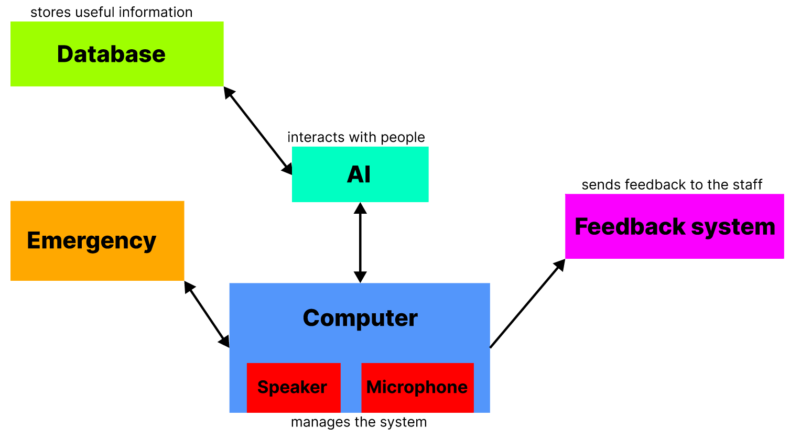

# MemoryMate

## Overview

This project has been started as my moonshot project for ALGOSUP.

This project would deal with developing an AI system that supports individuals with Alzheimer's in their daily lives. It could find some personal information from a database, and supply the information to the people with reminders, or if they ask for. It would be a way to support people who are often alone. It would be linked with a emergency system, alerting caregivers or emergency contacts in case of emergencies.

## Tools

- Python programming language -> popular in the field of artificial intelligence and machine learning
- Natural Language Processing (NLP) -> to understand and process natural language queries
- Database (SQL) -> to stock and supply some information
- Web Development -> to create a user interface through which individuals can interact with the AI [**OPTIONAL**]

## Contributors

| Photo | Name | Role | Links |
|---|---|---|---|
|  | GUILLOUCHE Enzo | Project Multitasker | [GitHub](https://github.com/EnzoGuillouche/) [LinkedIn](https://www.linkedin.com/in/enzo-g-b62114293/) |
